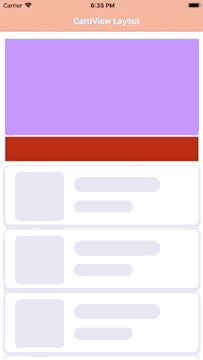
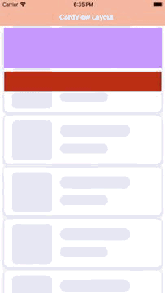
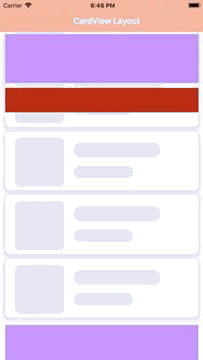
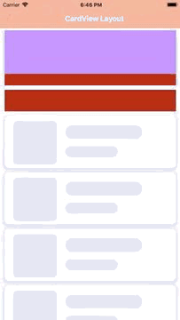

# SwiftyLayouts

[](https://gitter.im/SwiftyLayouts/Lobby?utm_source=badge&utm_medium=badge&utm_campaign=pr-badge&utm_content=badge)

                 

---

## Release Notes

library used to provide delight collection view layouts.

- [X] Pure Swift 4.
- [X] Works with every `UICollectionView`.
- [X] vertical scrolling support.

## Requirements

- iOS 10.0+
- Xcode 9.0+
- Swift 4.0+

## Communication

- If you **found a bug**, open an issue.
- If you **have a feature request**, open an issue.
- If you **want to contribute**, submit a pull request.

## Installation

### CocoaPods

[CocoaPods](http://cocoapods.org) is a dependency manager for Cocoa projects. You can install it with the following command:

```bash
$ gem install cocoapods
```

> CocoaPods 1.1+ is required to build SwiftyLayouts 1.0.0

To integrate SwiftyLayouts into your Xcode project using CocoaPods, specify it in your `Podfile`:

```ruby
source 'https://github.com/CocoaPods/Specs.git'
platform :ios, '10.0'
use_frameworks!

target '<Your Target Name>' do
pod 'SwiftyLayouts', '~> 1.0.0'
end
```

Then, run the following command:

```bash
$ pod install
```

### Manually

If you prefer not to use any of the aforementioned dependency managers, you can integrate SwiftyLayouts into your project manually.

#### Embedded Framework

- Open up Terminal, `cd` into your top-level project directory, and run the following command "if" your project is not initialized as a git repository:

```bash
$ git init
```

- Add SwiftyLayouts as a git [submodule](http://git-scm.com/docs/git-submodule) by running the following command:

```bash
$ git submodule add https://github.com/kaushlendrapal/SwiftyLayouts.git
```

- Open the new `SwiftyLayouts` folder, and drag the `SwiftyLayouts.xcodeproj` into the Project Navigator of your application's Xcode project.

> It should appear nested underneath your application's blue project icon. Whether it is above or below all the other Xcode groups does not matter.

- Select the `SwiftyLayouts.xcodeproj` in the Project Navigator and verify the deployment target matches that of your application target.
- Next, select your application project in the Project Navigator (blue project icon) to navigate to the target configuration window and select the application target under the "Targets" heading in the sidebar.
- In the tab bar at the top of that window, open the "General" panel.
- Click on the `+` button under the "Embedded Binaries" section.
- You will see two different `SwiftyLayouts.xcodeproj` folders each with two different versions of the `SwiftyLayouts.framework` nested inside a `Products` folder.

> It does not matter which `Products` folder you choose from, but it does matter whether you choose the top or bottom `SwiftyLayouts.framework`.

- Select the top `SwiftyLayouts.framework` for iOS.

> You can verify which one you selected by inspecting the build log for your project. The build target for `SwiftyLayouts` will be listed as either `Alamofire iOS`

- And that's it!

> The `SwiftyLayouts.framework` is automagically added as a target dependency, linked framework and embedded framework in a copy files build phase which is all you need to build on the simulator and a device.

## Setup

##### Find the above displayed examples in the `SwiftyLayoutsExample` folder.

## Contributing

See the [CONTRIBUTING] document.
Thank you, [contributors]!

[CONTRIBUTING]: CONTRIBUTING.md
[contributors]: https://github.com/kaushlendrapal/SwiftyLayouts/graphs/contributors

## FAQ

####  How can I add Global header to Layout?


## License

SwiftyLayouts library are Copyright (c) 2018 www.ideveloperlab.com
It contains free software that may be redistributed under MIT license [LICENSE] .

[LICENSE]: /LICENSE


## About


library used to provide delight collection view layouts.

We love open source software!
See [our other projects][blogs]
or [hire us][hire] to help build your product.

[blogs]: https://ideveloperlab.com/blogs
[hire]: https://idevloperlab.com/hire_us/
[projects]: https://github.com/kaushlendrapal
